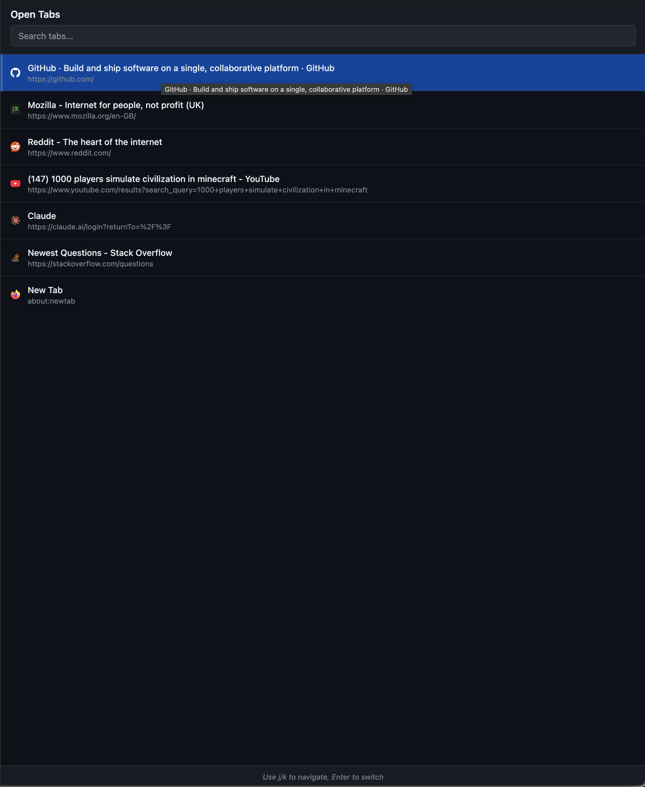
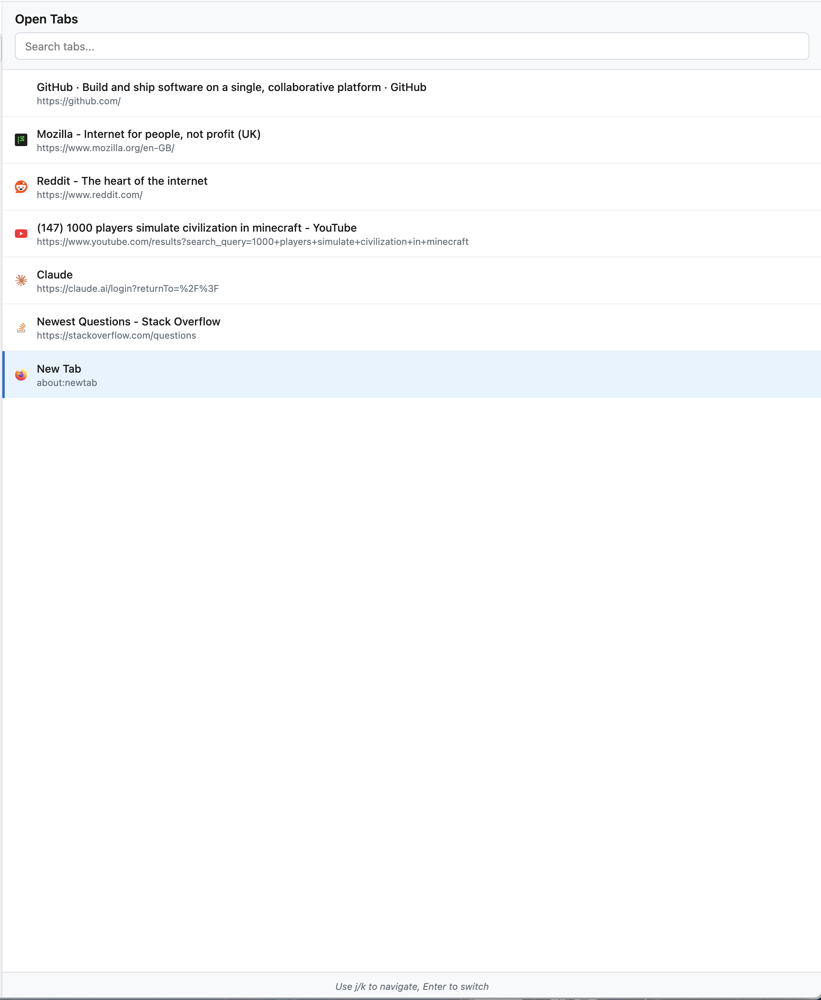
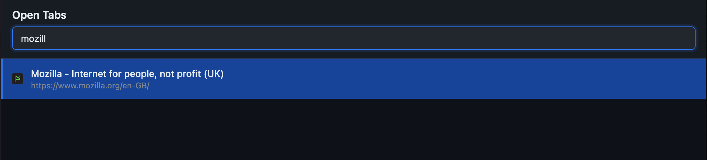

# tabdex

Navigate through all your open tabs effortlessly with tabdex. Features a clean, full-page interface with instant search
and vim-style keyboard navigation (j/k keys). Click the extension icon to open the tab navigator in a new tab,
search through your tabs by title or URL, and switch instantly with Enter. Perfect for power users managing multiple tabs.
Automatically adjusts to your dark or light theme.

## Screenshots

### Tab List


### Light Theme


### Search Filter


## Usage

1. Click the tabdex extension icon in your toolbar
2. A new tab opens with all your tabs listed
3. Use the search box to filter tabs by title or URL
4. Navigate with:
   - **j** or **↓** - Move down
   - **k** or **↑** - Move up  
   - **Enter** - Switch to selected tab
5. Click any tab to switch to it

I recommend putting the tabex tab in your first slot so you can quickly navigate to it from anywhere.
For navigating to your first tab use (cmd+1 on mac, ctrl+1 on windows or alt+1 on linux)

## Perfect Companions

tabdex works exceptionally well with:
- **Vimium** - For vim-style web browsing
- **Tree Style Tab** - For hierarchical tab organization

## Installation

### From Firefox Add-ons (Coming Soon)
Install directly from the [Firefox Add-ons store](https://addons.mozilla.org/en-GB/firefox/addon/tabdex/).

### Manual Installation
1. Download the latest release
2. Open Firefox and go to `about:debugging`
3. Click "This Firefox"
4. Click "Load Temporary Add-on"
5. Select the `manifest.json` file

## Development

### Requirements
- Node.js and npm
- web-ext (`npm install -g web-ext`)

### Building
```bash
# Lint the extension
web-ext lint

# Build for distribution
web-ext build

# Run in development
web-ext run
```
